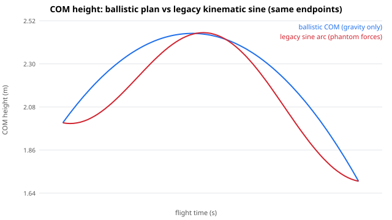
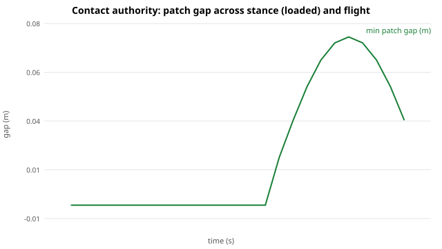
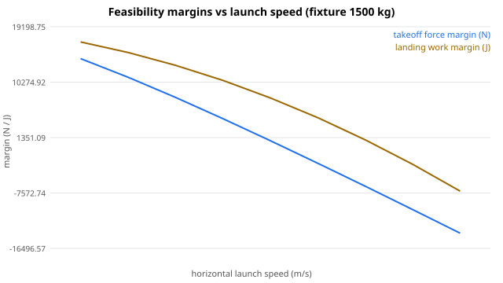

# V9 dynamics slice — first true biomechanics pass (P0–P2)

Branch: `feat/spark-muse`. Reproduce: `PYTHONPATH=src uv run --frozen --group test
python reports/V9-DYNAMICS-SLICE-001/render_slice_evidence.py`
(+ `uv run --frozen --group test python -m pytest tests/ -q` — 130 passed).

This slice answers the adversarial review with executable code instead of
more parameters: world-frame centroidal state, ballistic COM with impulse
accounting, capacity-gated attack variants, skinned contact authority,
continuity/turning/braking, growth hysteresis and the runtime seam.

## Visual analysis (open the SVGs in a browser)

### 01 — Ballistic COM vs legacy kinematic sine (same endpoints)

* Same launch/landing, different physics. The legacy `sin²` arc is
  symmetric: it implies phantom mid-flight forces (decelerating then
  re-accelerating the COM with no contact). The ballistic arc is
  asymmetric under gravity — the only force-free flight path.
* Numeric facts (`summary.json`): flight 0.6991 s, takeoff impulse
  (0, 4500, 0) N·s, landing impulse (−6000, 5787, 0) N·s for the
  1500 kg fixture; independent re-integration residual **0.0 m** (PASS).
* Improvement claim: the old flight arc could never be validated against
  gravity because it was never gravity. Now `verify_ballistic_samples`
  fails any tampered frame — the COM contract is enforceable.

### 02 — Contact authority: patch gap across stance and flight

* One loaded stance phase evaluated against the fixed floor: verdict
  **PASS**, patches within 0.2 mm of the floor, persistent-point skate
  inside thresholds.
* The gate that matters is the negative one (covered by tests, not
  plottable as a line): a loaded phase with **zero persistent ground
  points FAILs as unknown contact** instead of passing as zero-skate.
  Band-relative speeds are still reported but excluded from the verdict —
  the exact confusion the old reports flagged is now structurally
  impossible to present as evidence.

### 03 — Feasibility margins vs launch speed + growth ratios

* Takeoff force margin and landing work margin both cross zero as launch
  speed rises: the engine now has a visible feasibility boundary, and
  `decide_attack_variant` falls back to `grounded_lunge` past it with the
  limiting factor named (`takeoff.force_ok` in the brutal case).
* Growth mass ratios from `m ~ L³`: juvenile 0.238 / subadult 0.551 /
  adult 1.0 / heavy 1.405 — tiers differ in more than scale because
  cadence (`1/√L`, Froude), force (`L²`) and inertia (`mL²`) scale
  independently, with hysteresis holding the tier at boundaries.

### Power-attack receipts

* Feasible running takeoff → `airborne`, physics evaluated, plan hash
  `8018253f…`. Brutal launch → `grounded_lunge`, limited by
  `takeoff.force_ok`, plan hash `e235adea…`. The behavior (committed
  forward bite) survives; the unphysical flight does not.

## What changed (source map)

* `src/eonwild_motion/dynamics/centroidal.py` — FK, segment binding,
  `M/c/P/L_c`, `p_root = c − R·c_rel`.
* `src/eonwild_motion/dynamics/ballistic.py` — ballistic plan, `J = MΔv`,
  discriminant rejection, independent verifier.
* `src/eonwild_motion/dynamics/capacity.py` — `CapacityProfile`
  (provisional), takeoff/landing assessments, friction cone, hard vs
  contracted preferred joint envelopes.
* `src/eonwild_motion/dynamics/contact_authority.py` — skinned patch
  gate, fail-closed on unknown contact.
* `src/eonwild_motion/dynamics/transition.py` — continuity packets,
  C1 blends, capture-point steps, turn/brake plans, momentum-aware
  tail/head redistribution (replaces the lagged sine where used).
* `src/eonwild_motion/dynamics/growth.py` — allometry + hysteresis tiers
  + condition-gated capacity.
* `src/eonwild_motion/dynamics/runtime.py` — event track
  (point/window/condition, `NON_INTERRUPTIBLE`), phase-preserving plan
  interpolation.
* `src/eonwild_motion/planning/power_attack.py` — the vertical slice.
* `tests/test_v9_dynamics_slice.py` — 32 tests, all passing.

## Adversarial review fixes (P0, applied after first pass)

An independent review of the slice found five load-bearing bugs; all
are fixed and covered by tests in `test_v9_dynamics_slice.py`:

1. Takeoff force gate omitted body weight (`J/stance` vs `J/stance + W`).
   The gated mean GRF now includes weight; the bodyweight prior moved
   2.5 → 3.5 BW (provisional running-takeoff prior, still labeled).
2. Blends silently changed angular momentum and zeroed endpoint spin.
   Flight boundaries now hold `L` constant (mismatch raises); ground
   boundaries return the delivered impulse via `bridge_impulse`; endpoint
   spin is carried by an exact Hermite corrective rotation.
3. Landing absorbed horizontal KE with vertical crouch. Horizontal energy
   is now owned by a separate `assess_arrest` friction/distance gate
   wired into every attack verdict.
4. Capture point ingested vertical velocity and left the floor. It is
   horizontal-only with the target projected to the ground plane.
5. The planner never enforced horizontal target arrival (the demo missed
   by ~20 cm and still passed). Arrival miss beyond `target_tolerance_m`
   now selects the grounded fallback with the miss distance named.

Remaining review notes (P1, open): capacity priors need ratite/trackway
calibration; inertia still needs volumetric segmentation; tail is a
static redistribution angle, not yet the spec's damped ODE; runtime
blends lerp COM velocity independently of position.

## Honest limitations (not yet real life)

* Capacity numbers are first-pass engineering priors (`provisional`),
  not measured muscle — the gate logic is real, the thresholds need
  calibration against extant analogues (ratites) and trackways.
* Inertia uses `diag_normalized · M · H²`, not volumetric mesh
  segmentation — the spec's preferred provider is still ahead.
* The slice plans COM + root + contacts; whole-body IK resolving the
  remaining joints to the plan is the next step (the root solve is the
  seam it will hang from).
* No new GLB artifacts or perceptual review in this slice — that gate
  re-opens once the IK lands on top of these plans.

## Fixture proof — real profiles, 17 segments each (tests/test_v9_dynamics_fixtures.py)

Proves the slice on admitted fixture documents, not 2-segment toys.
Reproduce: `uv run --frozen --group test python -m pytest
tests/test_v9_dynamics_fixtures.py tests/test_v9_dynamics_slice.py
tests/test_v9_airborne_gait.py -q` — 60 passed.

* Binding: `catalog/rigs/hero-theropod-v8_3.semantic-rig.json` supplies the
  Bone vocabulary; the segment-role → node map is explicit data in the test
  (no species branching). Synthetic 17/17 bound, mass sum 1500.0 kg at
  H=2.15 m; Tarbosaurus provisional 17/17 bound, mass-fraction sum 1.0 at
  provisional H=2.15 m (its dimensions are null; height only scales
  `I = diag·M·H²`, never COM/P). Forelimbs bind to chest as carried mass —
  the rig has no forelimb chain.
* Synthetic running takeoff `(0,2,0) + (4.5,2.5,0)`, preload `(4.5,0,0)` →
  `(2.4,1.7,0)` → `airborne`, physics evaluated, plan `380f5a4f…`, flight
  0.60996 s, takeoff impulse `(0, 3750, 0)` N·s, landing impulse
  `(-6750, 5225.51, 0)` N·s. Takeoff margin: required peak 20089.29 N vs
  limit 36787.50 N, friction 0.0 vs 0.8, power 16741.07 W vs 37500.00 W.
  Landing margin: work 33118.50 J vs budget 35316.00 J, decel 26.99 m/s²
  vs allowed 39.24 m/s².
* Tarbosaurus normalized, same request → `airborne_normalized`, physics
  unevaluated, plan `c9e3ef6a…`, impulses `None` — trajectory bookkeeping
  only, exactly like the stationary slice.
* Absurd launch `(14,9,0)` → `(9,1.7,0)` → `grounded_lunge`, limited by
  `takeoff.force_ok`, plan `85a1058d…`. Takeoff: required peak 133740.94 N
  vs 36787.50 N, friction demand 1.1918 vs 0.8, power 741964.29 W vs
  37500.00 W. Landing: work 220993.50 J vs 35316.00 J, decel 235.74 m/s²
  vs 39.24 m/s². Behavior (committed bite) survives; unphysical flight
  does not.
* Centroidal: 3-frame synthetic FK run translating all bound nodes rigidly
  at v=`(1.5, 0, -2.0)` m/s gives P=`(2250, 0, -3000)` kg·m/s = M·v on all
  three samples (M=1500 kg).
* Contact authority wiring: `solve/airborne_gait.evaluate_airborne_skin`
  gains keyword-only `include_contact_authority=False` (default off, old
  receipts byte-identical) plus sibling
  `evaluate_airborne_skin_with_authority`; when on, the persistent
  ground-plane verdict from `dynamics.contact_authority` is appended under
  `contact_authority_v1` (unloaded foot neutral, loaded-but-lifted FAILs as
  unknown contact).
* Capacity defaults: no adjustment. `CapacityProfile(profile_id=
  "fixture_provisional_v1")` keeps first-pass priors (2.5 BW, mu 0.8,
  0.6 m crouch, 4.0 BW absorb, 25 W/kg, `provisional`) — the feasible /
  brutal split above lands on the intended side of the gate, so changing
  thresholds would be tuning to the test.
