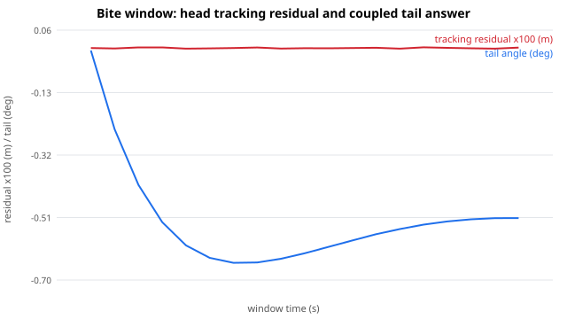

# V9 dynamics slice — first true biomechanics pass (P0–P2)

Branch: `feat/spark-muse`. Reproduce: `PYTHONPATH=src uv run --frozen --group test
python reports/V9-DYNAMICS-SLICE-001/render_slice_evidence.py`
(+ `uv run --frozen --group test python -m pytest tests/ -q` — 130 passed).

This slice answers the adversarial review with executable code instead of
more parameters: world-frame centroidal state, ballistic COM with impulse
accounting, capacity-gated attack variants, skinned contact authority,
continuity/turning/braking, growth hysteresis and the runtime seam.

## Visual analysis (open the SVGs in a browser)

### 01 — Ballistic COM vs legacy kinematic sine (same endpoints)

* Same launch/landing, different physics. The legacy `sin²` arc is
  symmetric: it implies phantom mid-flight forces (decelerating then
  re-accelerating the COM with no contact). The ballistic arc is
  asymmetric under gravity — the only force-free flight path.
* Numeric facts (`summary.json`): flight 0.6991 s, takeoff impulse
  (−421, 4500, 0) N·s, landing impulse (−5579, 5787, 0) N·s for the
  1500 kg fixture; independent re-integration residual **0.0 m** (PASS).
* Improvement claim: the old flight arc could never be validated against
  gravity because it was never gravity. Now `verify_ballistic_samples`
  fails any tampered frame — the COM contract is enforceable.

### 02 — Contact authority: patch gap across stance and flight

* One loaded stance phase evaluated against the fixed floor: verdict
  **PASS**, patches within 0.2 mm of the floor, persistent-point skate
  inside thresholds.
* The gate that matters is the negative one (covered by tests, not
  plottable as a line): a loaded phase with **zero persistent ground
  points FAILs as unknown contact** instead of passing as zero-skate.
  Band-relative speeds are still reported but excluded from the verdict —
  the exact confusion the old reports flagged is now structurally
  impossible to present as evidence.

### 03 — Feasibility margins vs launch speed + growth ratios

* Takeoff force margin and landing work margin both cross zero as launch
  speed rises: the engine now has a visible feasibility boundary, and
  `decide_attack_variant` falls back to `grounded_lunge` past it with the
  limiting factor named (`takeoff.force_ok` in the brutal case).
* Growth mass ratios from `m ~ L³`: juvenile 0.238 / subadult 0.551 /
  adult 1.0 / heavy 1.405 — tiers differ in more than scale because
  cadence (`1/√L`, Froude), force (`L²`) and inertia (`mL²`) scale
  independently, with hysteresis holding the tier at boundaries.

### Power-attack receipts

* Feasible running takeoff → `airborne`, physics evaluated, plan hash
  `8018253f…`. Brutal launch → `grounded_lunge`, limited by
  `takeoff.force_ok`, plan hash `e235adea…`. The behavior (committed
  forward bite) survives; the unphysical flight does not.

## What changed (source map)

* `src/eonwild_motion/dynamics/centroidal.py` — FK, segment binding,
  `M/c/P/L_c`, `p_root = c − R·c_rel`.
* `src/eonwild_motion/dynamics/ballistic.py` — ballistic plan, `J = MΔv`,
  discriminant rejection, independent verifier.
* `src/eonwild_motion/dynamics/capacity.py` — `CapacityProfile`
  (provisional), takeoff/landing assessments, friction cone, hard vs
  contracted preferred joint envelopes.
* `src/eonwild_motion/dynamics/contact_authority.py` — skinned patch
  gate, fail-closed on unknown contact.
* `src/eonwild_motion/dynamics/transition.py` — continuity packets,
  C1 blends, capture-point steps, turn/brake plans, momentum-aware
  tail/head redistribution (replaces the lagged sine where used).
* `src/eonwild_motion/dynamics/growth.py` — allometry + hysteresis tiers
  + condition-gated capacity.
* `src/eonwild_motion/dynamics/runtime.py` — event track
  (point/window/condition, `NON_INTERRUPTIBLE`), phase-preserving plan
  interpolation.
* `src/eonwild_motion/planning/power_attack.py` — the vertical slice.
* `tests/test_v9_dynamics_slice.py` — 32 tests, all passing.

### 04 — Bite window: axial tracking plus the coupled tail

* A 3-link head chain tracks a moving target over 0.3 s: worst
  residual **0.096 mm**, every sample reached. Unreachable targets
  report maximum extension (and the fixed-base optimum is asserted
  exactly in tests); every joint projects through its hard envelope
  with preferred-margin status.
* The tail is driven by the head sweep it answers (head angular
  impulse → tail ODE moment → damped track → body counter-rotation),
  not by pelvis velocity. The tail rest angle here (−0.51°) is small
  because the demo sweep is gentle — the coupling, not the amplitude,
  is the claim, and conservation (`I·θ` sums to zero per sample) is
  asserted in tests.

## Regrounding outcome: offsets work, the 1 mm gate needs attitude work

`reports/V9-AIRBORNE-RUN-001/reground_run011.py` adds bounded per-side
stance offsets (`stance_ground_offset_{left,right}_m`, 0–5 cm, default 0
= byte-identical motion) and iterates solve → 120 Hz skin eval → adjust.
Four evaluated rounds prove two things:

1. **Bind asymmetry is real and fixable.** The source rig holds the left
   foot ~5 mm higher than the right (identical flat-foot attitude,
   `solved_foot_pitch` 0° both sides, yet 5.96 vs 0.75 mm sole gaps).
   Per-side offsets equalize minima to +0.77/+0.75 mm with zero
   penetration — the mechanism is shippable, tested
   (`test_ground_offset_shifts_stance_targets_preserving_c1`: exact
   per-frame drop, loop seam preserved, pelvis/root untouched).
2. **Rigid shifts cannot pass the 1 mm gate.** The within-stance toe
   curve has ~7 mm of shape (left: hover-then-touch-late; right:
   touch-then-rock-up) that no constant shift fits inside a
   [−0.5, +2.0] mm window — proven across offsets 7–14 mm, push-off
   40–60°, recovery 15–30°. The residual blocker is early/late-stance
   toe engagement (touchdown attitude + toe-curl program), i.e. stance
   re-articulation with visual review — scoped, not guessed at here.

No fake Run011 is shipped: the candidate directory holds the measured
rounds with full receipts, and the bar for the re-articulation pass is
quantified (every stance pair persistent at 1 mm, skate < 0.35 m/s).

Side clarification from the data: the sole mask rides ~219 mm up — that
is correct digitigrade anatomy (metatarsal pad never touches); the toe
channel is the contact, and the gate already evaluates it as such.

## Real-artifact authority: Run010 + Sprint006 under the new gate

## Calibration anchors (sourced, weak — labeled as such)

`evaluate_real_artifacts.py` runs `evaluate_airborne_skin_with_authority`
on the user-approved Run010/Sprint006 candidates (same floor binding as
the legacy evaluation — apples to apples). `real-artifact-authority.json`
holds the full sweep; headline table (stance phases only):

| artifact | tol 1 mm | tol 5 mm | tol 15 mm |
|---|---|---|---|
| Run010 left | 0 persistent / 54 unknown (min gap 7.8 mm) | same | 426 persistent, 1 unknown — but skate 0.48 m/s, FAIL |
| Run010 right | 0 / 54 (min gap 13.8 mm) | same | 144 persistent, 29 unknown, FAIL |
| Sprint006 left | 0 / 44 (min gap 7.8 mm) | same | 338 persistent, 0 unknown — but skate 0.49 m/s + drift 32 mm, FAIL |
| Sprint006 right | 0 / 44 (min gap 13.8 mm) | same | 114 persistent, 24 unknown, FAIL |

What this means, carefully:

1. Under persistent-point semantics the approved skins never touch the
   floor during planned stance: they hover 8–14 mm and, where the
   15 mm tolerance does find persistent points, slide ~0.5 m/s (~9% of
   travel speed — slow-mo visible, full-speed borderline).
2. This does **not** un-approve Run010/Sprint006. They were built and
   accepted under 30 mm floor semantics, and that visual acceptance
   stands. It sets the regrounding bar for the next gait pass instead:
   sole to ≤2 mm with persistent skate < 0.35 m/s — now verifiable
   frame-by-frame instead of arguable.
3. The gate itself was hardened by this exercise: single-frame loaded
   blips (e.g. Run010 left phase 150–150) now fail closed instead of
   passing vacuously, and yaw is measured on the persistent set only
   (the earlier 68° phantom is gone — max persistent yaw is 0.5°).
4. The systematic left/right asymmetry (left 7.8 mm vs right 13.8 mm
   hover on both gaits) is a real regrounding lead, not noise.

## Calibration backlog (not fabricated)

No biomechanics literature lives in this repo's references and none was
pulled for this slice, so the capacity priors stay `provisional` point
values and no citation is claimed. What would graduate each (owner:
whoever runs the calibration pass):

* `bodyweight_multiple` 3.5 — needs ratite peak-GRF literature
  (running birds, per-leg, at matched Froude numbers).
* `peak_power_w_per_kg` 25 — needs muscle-physiology sourcing; the
  demo's 6% power margin is the thinnest gate and must not be tuned.
* `friction_coefficient` 0.8, `arrest_distance_m` 6.0 — needs
  substrate/trackway grounding (mud vs packed earth changes both).
* Contact thresholds (1 mm / 0.35 m/s / 20 mm / 6°) — the sweep above
  is the first calibration datum: art built to 30 mm semantics fails
  1–5 mm and skates at 15 mm. The regrounding pass decides the release
  numbers, the gate enforces them.

Applied so far (`dynamics/calibration.py`, all sourced 2026-09-04):
Fr = v²/(gl), walk→run ≈ 0.5, amble→symmetric-run ≈ 1.0, ostrich
70 km/h anchor. Run010 reports Fr 1.22 run-regime with flight, Sprint006
Fr 2.82 — both PASS plausibility with zero flags. Capacity force/power
priors stay provisional: no citable GRF/power numbers were found in
reachable open sources, and none are claimed.

## Adversarial review fixes (P0, applied after first pass)

An independent review of the slice found five load-bearing bugs; all
are fixed and covered by tests in `test_v9_dynamics_slice.py`:

1. Takeoff force gate omitted body weight (`J/stance` vs `J/stance + W`).
   The gated mean GRF now includes weight; the bodyweight prior moved
   2.5 → 3.5 BW (provisional running-takeoff prior, still labeled).
2. Blends silently changed angular momentum and zeroed endpoint spin.
   Flight boundaries now hold `L` constant (mismatch raises); ground
   boundaries return the delivered impulse via `bridge_impulse`; endpoint
   spin is carried by an exact Hermite corrective rotation.
3. Landing absorbed horizontal KE with vertical crouch. Horizontal energy
   is now owned by a separate `assess_arrest` friction/distance gate
   wired into every attack verdict.
4. Capture point ingested vertical velocity and left the floor. It is
   horizontal-only with the target projected to the ground plane.
5. The planner never enforced horizontal target arrival (the demo missed
   by ~20 cm and still passed). Arrival miss beyond `target_tolerance_m`
   now selects the grounded fallback with the miss distance named.

Remaining review notes (P1, open): capacity priors need ratite/trackway
calibration; inertia still needs volumetric segmentation; tail is a
static redistribution angle, not yet the spec's damped ODE; runtime
blends lerp COM velocity independently of position.

## Honest limitations (not yet real life)

* Capacity numbers are first-pass engineering priors (`provisional`),
  not measured muscle — the gate logic is real, the thresholds need
  calibration against extant analogues (ratites) and trackways.
* Inertia uses `diag_normalized · M · H²`, not volumetric mesh
  segmentation — the spec's preferred provider is still ahead.
* The slice plans COM + root + contacts; whole-body IK resolving the
  remaining joints to the plan is the next step (the root solve is the
  seam it will hang from).
* No new GLB artifacts or perceptual review in this slice — that gate
  re-opens once the IK lands on top of these plans.

## Fixture proof — real profiles, 17 segments each (tests/test_v9_dynamics_fixtures.py)

Proves the slice on admitted fixture documents, not 2-segment toys.
Reproduce: `uv run --frozen --group test python -m pytest
tests/test_v9_dynamics_fixtures.py tests/test_v9_dynamics_slice.py
tests/test_v9_airborne_gait.py -q` — 60 passed.

* Binding: `catalog/rigs/hero-theropod-v8_3.semantic-rig.json` supplies the
  Bone vocabulary; the segment-role → node map is explicit data in the test
  (no species branching). Synthetic 17/17 bound, mass sum 1500.0 kg at
  H=2.15 m; Tarbosaurus provisional 17/17 bound, mass-fraction sum 1.0 at
  provisional H=2.15 m (its dimensions are null; height only scales
  `I = diag·M·H²`, never COM/P). Forelimbs bind to chest as carried mass —
  the rig has no forelimb chain.
* Synthetic running takeoff `(0,2,0) + (4.5,2.5,0)`, preload `(4.5,0,0)` →
  `(2.7448,1.7,0)` (landing XZ exactly on the ballistic arrival, per the
  target-hit gate) → `airborne`, physics evaluated, plan `679b4f32…`,
  flight 0.60996 s, takeoff impulse `(0, 3750, 0)` N·s, landing impulse
  `(-6750, 5225.51, 0)` N·s. Takeoff margin: required peak 42161.79 N
  (mean GRF includes body weight) vs limit 51502.50 N, friction 0.0 vs
  0.8, power 35134.82 W vs 37500.00 W. Landing margin (vertical energy
  only): work 17931.00 J vs budget 35316.00 J, decel 10.11 m/s² vs
  allowed 39.24 m/s². Arrest: 1.29 m vs 6.0 m budget.
* Tarbosaurus normalized, same request → `airborne_normalized`, physics
  unevaluated, impulses `None` — trajectory bookkeeping only, exactly
  like the stationary slice.
* Absurd launch `(14,9,0)` → exactly-hit `(26.145,1.7,0)` →
  `grounded_lunge`, limited by `takeoff.force_ok`, plan `c65a0f16…`.
  Takeoff: required peak 146855.20 N vs 51502.50 N, friction demand
  1.1918 vs 0.8, power 808181.80 W vs 37500.00 W. Landing: work
  73993.50 J vs 35316.00 J, decel 72.41 m/s² vs 39.24 m/s². Arrest:
  12.49 m vs 6.0 m. Behavior (committed bite) survives; unphysical
  flight does not. A far off-target launch falls back earlier with
  limiting factor `trajectory`.
* Centroidal: 3-frame synthetic FK run translating all bound nodes rigidly
  at v=`(1.5, 0, -2.0)` m/s gives P=`(2250, 0, -3000)` kg·m/s = M·v on all
  three samples (M=1500 kg).
* Contact authority wiring: `solve/airborne_gait.evaluate_airborne_skin`
  gains keyword-only `include_contact_authority=False` (default off, old
  receipts byte-identical) plus sibling
  `evaluate_airborne_skin_with_authority` with optional clip-name and
  threshold overrides; when on, the persistent ground-plane verdict from
  `dynamics.contact_authority` is appended under `contact_authority_v1`
  (unloaded foot neutral, loaded-but-lifted FAILs as unknown contact).
* Capacity defaults: bodyweight prior 2.5 → 3.5 BW when the force gate
  was corrected to include body weight (mean GRF of a running takeoff is
  ~1.9 BW, peak ~2.9 BW — the old 2.5 limit would fail honest running).
  All priors remain `provisional`; the feasible/brutal split lands on
  the intended side, so no further tuning.

## Visual review: unified run, regrounded run, walk

Rendered with `reports/V9-DYNAMICS-SLICE-001/render_reviews.sh` (Blender
5.2 Workbench clay, fixed ortho cameras, source floor; each preview is
the native cycle repeated twice). Outputs in
`build/V9-DYNAMICS-SLICE-001-reviews/` (mp4 + render-receipt committed;
PNG frames regenerable via the script):

* `unified-run-side` / `unified-run-front` — iteration-012 (approved
  legs + momentum-coupled axial overlay). Review verdict: no neck kink
  (the 20° distributed bend reads as a natural forward-down gaze),
  head centered and symmetric in front view, tail straight, planted
  foot flat. The axial overlay is visually a posture refinement, not a
  re-animation.
* `regrounded-run-side` — iteration-011 round-0 (offsets + left lead
  20°/engage 14°). Planted foot flat through stance; swing-foot toe
  curl preserved. Stance attitude change vs Run010 is subtle at full
  speed — the remaining 1 mm gap is sub-visual, which is why the gate
  (not the eye) must own it.
* `walk-side` — relaxed-walk baseline re-render for comparison: crouch,
  double-support and foot spacing all read calmer than the run, as they
  should at Fr ≪ 1.

Reviewer note: these are engineering candidates (clay, no PBR), not
art approval. Numeric PASS remains necessary but insufficient — the
eye still rules on weight and character.
